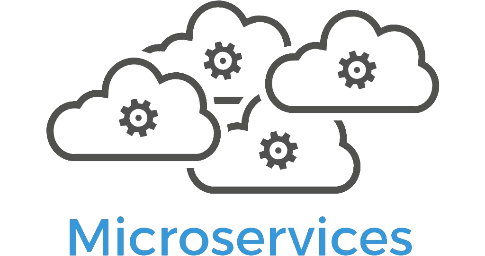
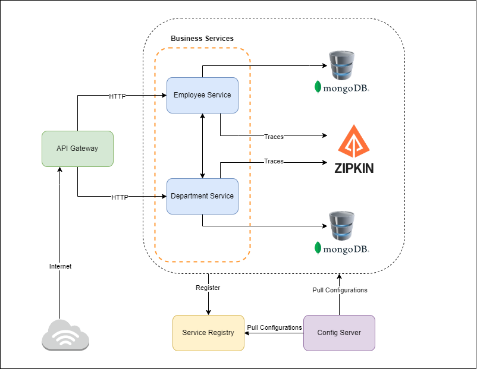

# **Spring-Boot---Microservices**

    <!-- Spring Boot -->
    
    &nbsp;&nbsp;&nbsp;&nbsp;&nbsp;&nbsp;
    <!-- Microservice -->
    
    &nbsp;&nbsp;&nbsp;&nbsp;&nbsp;&nbsp;
    <!-- MongoDB -->
    

---

# **Table of Contents**

- [**Spring-Boot---Microservices**](#spring-boot---microservices)
- [**Table of Contents**](#table-of-contents)
- [**Introduction**](#introduction)
  - [What are Microservices?](#what-are-microservices)
  - [Spring Boot](#spring-boot)
  - [Key Features](#key-features)
  - [Creating Spring Boot Microservices:](#creating-spring-boot-microservices)
  - [Benefits:](#benefits)
- [**Architectural Diagram**](#architectural-diagram)
- [**Project Dependencies**](#project-dependencies)
  - [Spring Web](#spring-web)
  - [MongoDB Driver](#mongodb-driver)
  - [Lombok](#lombok)
  - [OpenAPI / Swagger](#openapi--swagger)
  - [Actuator](#actuator)
  - [Zipkin](#zipkin)
  - [Eureka Server](#eureka-server)
  - [Eureka Discovery Client](#eureka-discovery-client)
  - [Gateway](#gateway)
  - [Config Server](#config-server)
  - [Config Client](#config-client)
  - [Spring Reactive Web](#spring-reactive-web)
- [**Spring Boot Annotations**](#spring-boot-annotations)
  - [@EnableEurekaServer:](#enableeurekaserver)
  - [@EnableDiscoveryClient](#enablediscoveryclient)
  - [@EnableConfigServer](#enableconfigserver)
  - [@HttpExchange, @GetExchange, @DeleteExchange:](#httpexchange-getexchange-deleteexchange)

---

# **Introduction**

Spring Boot is a powerful framework for building Java-based applications, and when it comes to creating microservices, it offers a robust and efficient approach. Here's a brief introduction to Spring Boot microservices:

## What are Microservices? 
Microservices architecture is an approach to software development where a single application is built as a suite of small, loosely coupled services. Each service focuses on a specific business capability and can be developed, deployed, and scaled independently.

## Spring Boot
Spring Boot is a project within the larger Spring ecosystem that simplifies the development of production-ready applications. It provides out-of-the-box configurations, embedded servers, and dependency management, allowing developers to quickly bootstrap Spring applications with minimal configuration.

## Key Features

- **Embedded Servers**: Spring Boot allows embedding servers like Tomcat, Jetty, or Undertow, making deployment and running of microservices straightforward.
- **Auto-configuration**: Spring Boot provides auto-configuration capabilities, which automatically configures the application based on the dependencies in the classpath.
- **Dependency Management**: It simplifies dependency management by providing a curated list of dependencies that are compatible with each other.
- **Actuator**: Spring Boot Actuator provides production-ready features like health checks, metrics, and monitoring, which are essential for microservices deployed in a distributed environment.
- **Spring Cloud**: Spring Boot works seamlessly with Spring Cloud, which offers additional tools and libraries for building distributed systems, including service discovery, circuit breakers, and distributed configuration management.

## Creating Spring Boot Microservices:
- Define each microservice as a separate Spring Boot project/module.
- Each microservice typically encapsulates a specific business capability.
- Use Spring MVC or Spring WebFlux for building RESTful APIs to expose functionalities.
- Leverage Spring Data for data access and integration with databases.
- Utilize Spring Security for authentication and authorization if needed.
- Communicate between microservices using RESTful APIs, messaging queues, or event-driven communication.

## Benefits:
- **Scalability**: Microservices allow individual components to scale independently based on demand.
- **Agility**: Microservices enable teams to work independently on different components, facilitating faster development and deployment cycles.
- **Resilience**: Failure in one microservice does not necessarily affect others, ensuring higher resilience.
- **Technology Diversity**: Different microservices can be built using different technologies, enabling teams to choose the best tool for the job.

---

# **Architectural Diagram**

# **Project Dependencies**

## Spring Web
- **Purpose:** Spring Web provides the foundational support for building web applications using Spring.
- **Functionality:**
  - Handles HTTP requests and responses.
  - Defines controllers to process incoming requests.
  - Supports various annotations for mapping URLs to controller methods, handling request parameters, and producing responses.
  - Facilitates the development of RESTful APIs and web-based applications.
- **Usage:** Essential for building web applications and RESTful APIs using Spring framework.

## MongoDB Driver
- **Purpose:** MongoDB Driver provides the necessary libraries and tools to connect Java applications with MongoDB databases.
- **Functionality:**
  - Enables communication between Java applications and MongoDB databases.
  - Supports CRUD operations (Create, Read, Update, Delete) on MongoDB documents.
  - Provides query capabilities to interact with MongoDB collections.
- **Usage:** Necessary for Java applications that utilize MongoDB as their database backend.

## Lombok
- **Purpose:** Lombok is a library that helps in reducing boilerplate code in Java applications by providing annotations to generate commonly used code.
- **Functionality:**
  - Automatically generates getters, setters, constructors, equals, hashCode, and toString methods based on class fields.
  - Simplifies the creation of POJOs (Plain Old Java Objects) by reducing the amount of code that needs to be written.
  - Enhances code readability and maintainability by reducing verbosity.
- **Usage:** Used to streamline the development process and reduce code verbosity in Java applications.

## OpenAPI / Swagger
- **Purpose:** OpenAPI, formerly known as Swagger, is a set of tools and specifications for designing, documenting, and testing RESTful APIs.
- **Functionality:**
  - Allows developers to define API specifications using a standardized format (OpenAPI Specification).
  - Generates interactive API documentation, making it easy for developers to understand and consume APIs.
  - Provides tools for automatic generation of client libraries in various programming languages.
- **Usage:** Facilitates API design, documentation, and testing, promoting consistency and interoperability in RESTful API development.

## Actuator
- **Purpose:** Spring Boot Actuator provides production-ready features to monitor and manage the application.
- **Functionality:**
  - Exposes various endpoints to monitor application health, metrics, environment details, etc.
  - Enables management and monitoring of the application using HTTP endpoints or JMX.
  - Facilitates monitoring of application internals, such as request tracing, heap dump, thread dump, etc.
- **Usage:** It's crucial for monitoring the health and performance of microservices in production environments.

## Zipkin
- **Purpose:** Zipkin is a distributed tracing system that helps in troubleshooting latency problems in microservices architectures.
- **Functionality:**
  - Captures and displays timing data across distributed systems.
  - Provides a visual representation of the flow of requests between microservices.
  - Helps in identifying performance bottlenecks and optimizing system performance.
- **Usage:** Integrating Zipkin enables developers to trace requests as they flow through various microservices, aiding in debugging and performance optimization.

## Eureka Server
- **Purpose:** Eureka Server, part of the Netflix OSS suite, is a service registry and discovery server used in microservices architectures.
- **Functionality:**
  - Allows microservices to register themselves and discover other services.
  - Provides a centralized registry of available services along with their locations (host and port).
  - Supports load balancing and failover by providing dynamic updates to service instances.
- **Usage:** Used to implement service discovery and registration in microservices architectures, enabling communication between services without hardcoding their locations.

## Eureka Discovery Client
- **Purpose:** Eureka is a service discovery solution provided by Spring Cloud Netflix.
- **Functionality:**
  - Allows microservices to register themselves and discover other services.
  - Enables load balancing and failover by providing a registry of available services.
  - Supports dynamic scaling of microservices by automatically updating service registry.
- **Usage:** Eureka Discovery Client helps microservices in locating and communicating with each other dynamically in a distributed environment.

## Gateway
- **Purpose:** Gateway, often referring to Spring Cloud Gateway, is an API gateway solution for managing and routing requests in microservices architectures.
- **Functionality:**
  - Acts as a reverse proxy for routing requests to appropriate microservices.
  - Supports various filters for handling cross-cutting concerns like security, logging, rate limiting, etc.
  - Enables dynamic routing based on various criteria like path, headers, etc.
- **Usage:** Gateway facilitates centralized management of routing and provides essential features like security and rate limiting for microservices.

## Config Server
- **Purpose:** Config Server, part of the Spring Cloud framework, provides centralized externalized configuration management for distributed systems.
- **Functionality:**
  - Acts as a central repository for storing and serving configuration properties to client applications.
  - Supports storing configuration properties in various backends like Git, SVN, JDBC, etc.
  - Allows dynamic reloading of configuration properties without requiring application restarts.
- **Usage:** Used to manage and distribute configuration properties across microservices in a distributed environment, promoting consistency and manageability.

## Config Client
- **Purpose:** Config Client is part of Spring Cloud Config, which provides externalized configuration management for microservices.
- **Functionality:**
  - Fetches configuration properties from a centralized configuration server.
  - Supports dynamic reloading of configuration properties without restarting the microservice.
  - Allows configuration to be managed centrally, providing consistency and manageability across microservices.
- **Usage:** Config Client enables microservices to fetch their configuration from a centralized configuration server, promoting maintainability and ease of management.

## Spring Reactive Web
- **Purpose:** Spring Reactive Web provides support for building reactive web applications using the Spring Framework.
- **Functionality:**
  - Enables the development of non-blocking, asynchronous web applications.
  - Utilizes reactive programming principles to handle a large number of concurrent requests efficiently.
  - Provides abstractions like Mono and Flux to represent asynchronous data streams and reactive operations.
- **Usage:** Ideal for building highly scalable, responsive, and resource-efficient web applications that can handle a large number of concurrent connections.

---

# **Spring Boot Annotations**

## @EnableEurekaServer:
Purpose: Enables the Eureka Server.
Functionality: Configures the application as a service registry and discovery server using Netflix Eureka.
Usage: Used in microservices architectures for services to register themselves with a centralized registry for discovery and communication.

## @EnableDiscoveryClient
- **Purpose:** Marks a Spring Boot application to enable service discovery.
- **Functionality:** Allows the application to register itself with a service registry (like Eureka) and discover other services.
- **Usage:** Used in microservices architectures where services need to find and communicate with each other dynamically.

## @EnableConfigServer
- **Purpose:** Enables the Spring Cloud Config Server.
- **Functionality:** Configures the application as a central configuration server. Client applications can fetch their configuration from this server.
- **Usage:** Used in distributed systems to manage and distribute configuration properties across services.

## @HttpExchange, @GetExchange, @DeleteExchange:
- **Purpose:** Specific to a certain context or framework (not standard Spring annotations).
- **Functionality:** Typically used for defining HTTP request mappings or endpoints in a web application framework.
- **Usage:** Depends on the specific framework or library they belong to and how they are intended to be used within the application code.